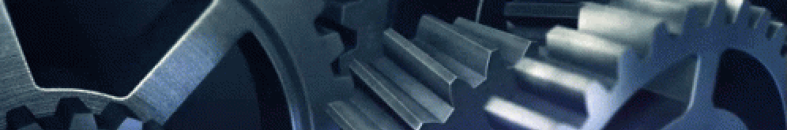

<b style="font-size:30vw;">Advanced Solid Mechanics</b>

This project has for purpose to introduce the plastic behavior of materials. Indeed, in solid mechanics, plasticity plays a major role in the explication of phenomenons such as irreversible de- formation, fatigue and fracture. Therefore, it is important to take a grasp regarding this theory by performing numerical experiments on, for example, a cube under uniaxial surface traction. These experiments are done using the software Metafor which is an object-oriented finite element code for the simulation of solids submitted to large deformations.
